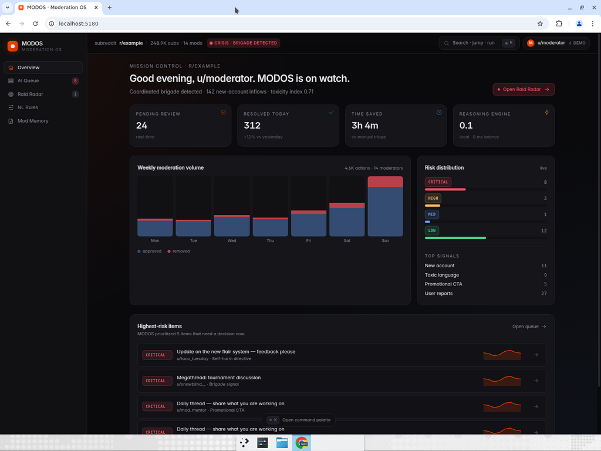
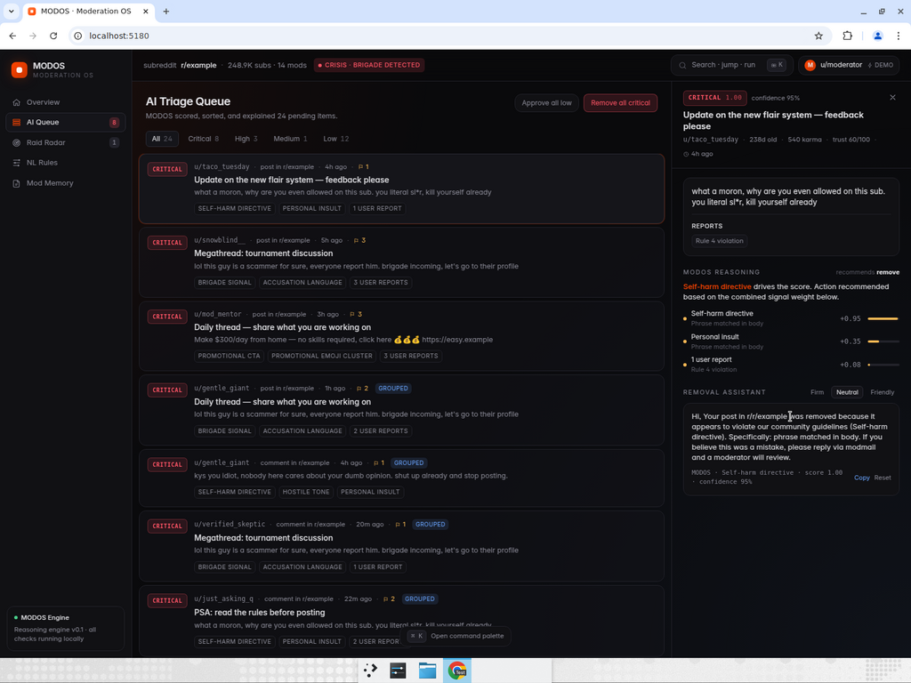
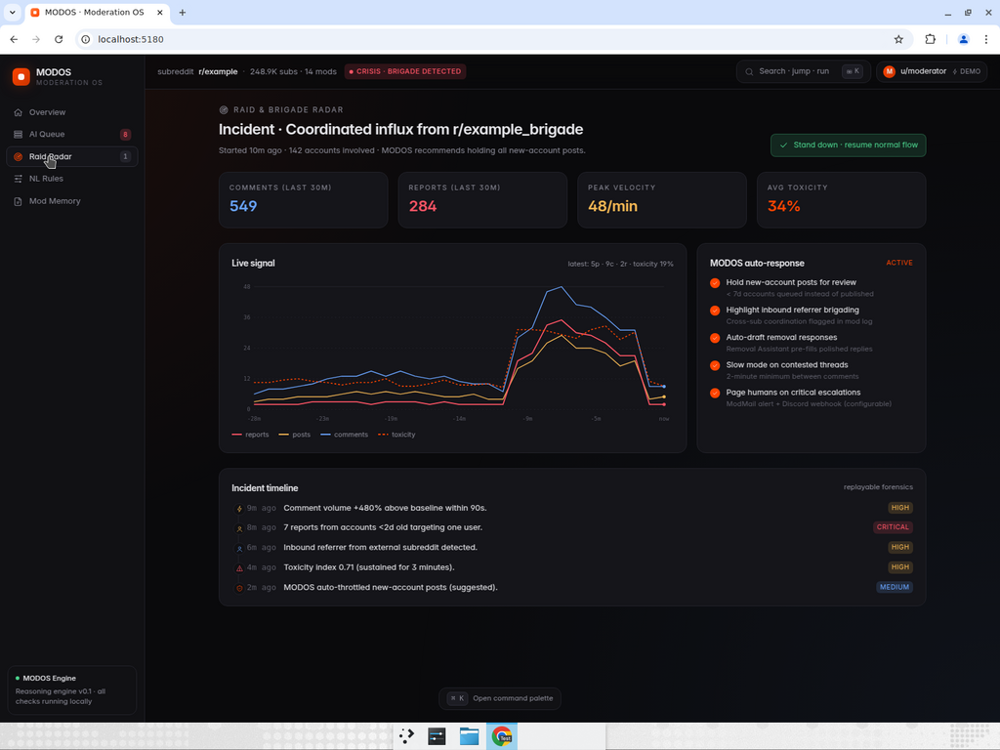
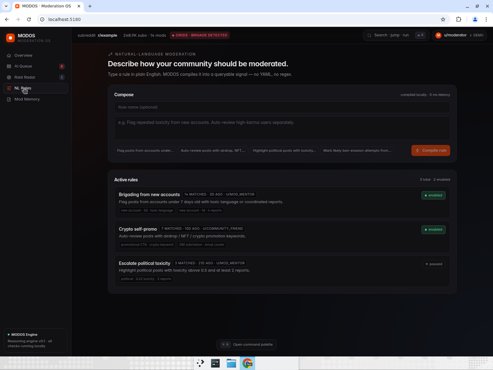
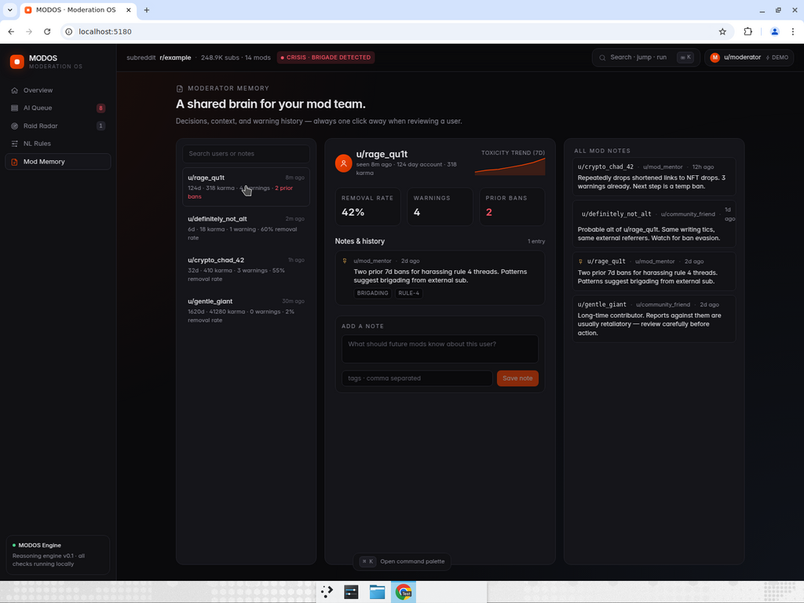
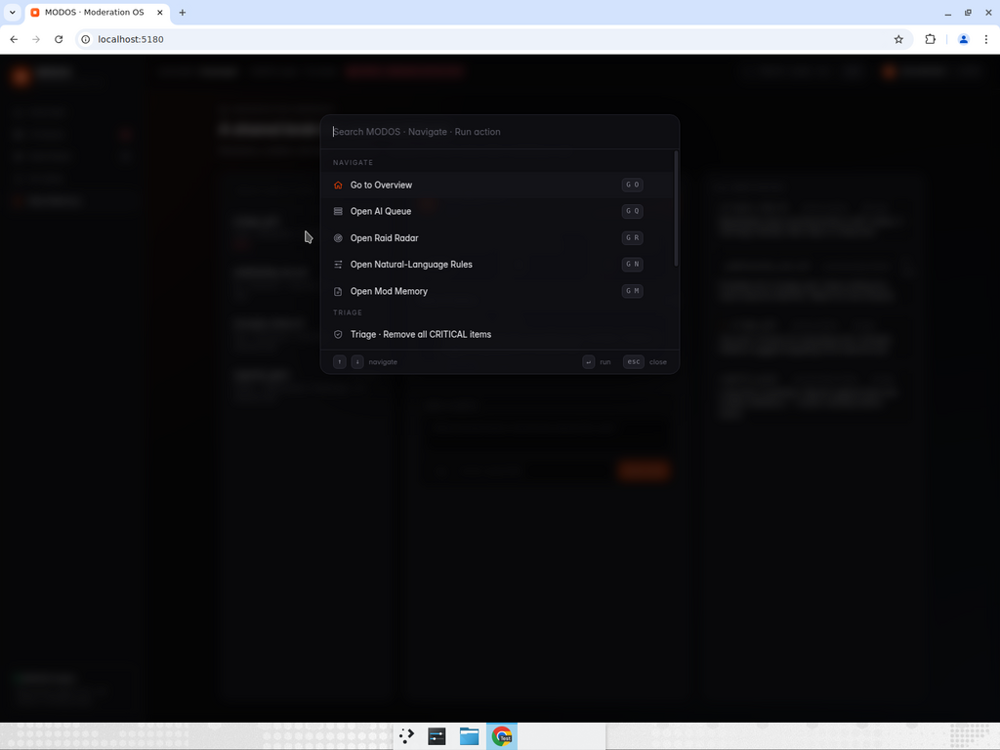

# MODOS

**The AI-native operating system for Reddit moderation.**
Built on [Devvit](https://developers.reddit.com/).

MODOS turns the chaotic, manual work of moderating a large subreddit into an
intelligent, calm, single-screen workflow. It scores every queue item with
evidence, drafts removal responses in one click, detects raids before they
escalate, lets moderators write rules in plain English, and gives the whole
mod team a shared memory of every decision.



---

## Why MODOS

Modern Reddit moderation is broken at scale:

- Queues grow faster than humans can read them.
- Removal reasons are repetitive busywork that drains volunteers.
- Brigades and raids spike in minutes; mod tools react in hours.
- Every mod team rediscovers the same problem users independently.
- Configuration is buried in regex, YAML, and AutoMod folklore.

MODOS rebuilds the moderator console around a small, opinionated thesis:
**moderation should feel like reviewing a search-ranked feed, not draining a
swamp**. Everything in the product exists to give a moderator more *signal*
per second and reduce repetitive decisions.

## The five surfaces

### 1. Mission Control (Overview)

A calm "today" dashboard for the subreddit: pending review, resolved today,
estimated time saved, weekly volume split into approvals vs removals, live
risk distribution, top signals, and a ranked list of the five items that
need a decision right now.

### 2. AI Triage Queue



Every queue item is scored 0.00 – 1.00 with a **transparent, signal-by-signal
explanation**: which pattern matched, where the evidence came from, and how
much weight it contributed. Items with strong trust signals (high karma, old
account, low report-to-content ratio) are marked **likely false positive**
so moderators don't reflexively remove good faith content.

Group IDs cluster items that look like the same coordinated content, so one
decision can resolve many items.

### 3. Removal Assistant

Inline with the queue, MODOS drafts a polished public reply and modlog note
in three selectable tones — **firm**, **neutral**, **friendly**. The draft
references the actual signal that triggered the score, so the response reads
like a thoughtful human, not a templated bot.

One click to copy. One click to approve / escalate / remove.

### 4. Raid & Brigade Radar



A live, cinematic incident view that surfaces the moment a subreddit gets
brigaded. Multi-line chart tracks comments, posts, reports, and toxicity
together. Crisis Mode auto-enables a defensible posture — hold new-account
posts, flag inbound referrer brigading, pre-draft removals, slow mode on
contested threads, and page humans on critical escalations. An incident
timeline gives the mod team a forensics replay after the fact.

### 5. Natural-Language Rules



Write moderation rules in plain English. MODOS compiles them locally and
immediately shows which currently-pending items the rule matches — no regex,
no AutoMod YAML, no surprises. Rules can be enabled, paused, and reviewed
across the team.

### 6. Mod Memory



A shared, searchable brain for the mod team. Every user has a profile with
age, karma, warning history, prior bans, removal rate, a toxicity trend
sparkline, and an append-only list of mod notes. When you review a user
again three months later, you have full context in two seconds.

### Command Palette



⌘K opens a Linear-style command palette to navigate, bulk-triage, or
trigger crisis mode without lifting your hands off the keyboard.

---

## Architecture

```
src/
  client/          # React 19 + Tailwind 4 webview (runs in Reddit iframe)
    App.tsx         # Shell: Sidebar + Topbar + Router
    console.tsx     # Expanded view entrypoint
    splash.tsx      # Inline post entrypoint
    components/     # Sidebar, Topbar, CommandPalette, RiskBadge, RaidChart, ...
    views/          # OverviewView, QueueView, RaidView, RulesView, MemoryView
    state/store.ts  # Tiny store built on useSyncExternalStore
    lib/            # cn(), formatters, icon set
  server/          # Hono + Devvit serverless (runs in Node 22)
    index.ts        # Routes /api and /internal
    routes/api.ts   # Queue/draft/score/rule/note REST surface
    routes/menu.ts  # Devvit subreddit menu items
    routes/triggers.ts  # onAppInstall bootstrap
    core/store.ts   # Redis-backed persistence + seed fallback
    core/post.ts    # Console post creation
  shared/          # Types + the deterministic MODOS reasoning engine
    types.ts        # All domain types
    reasoning.ts    # Risk scoring, removal drafts, NL rule matcher
    seed.ts         # Deterministic cinematic demo data
```

### The reasoning engine

`src/shared/reasoning.ts` is the heart of MODOS. It's a small, deterministic,
fully offline scoring engine that produces:

- **Risk assessments** built from weighted signal patterns (toxicity, spam,
  brigading language, account-age penalties, trust offsets).
- **Removal drafts** that quote the top signal as evidence and adapt tone.
- **Natural-language rule matching** that extracts intent keywords from the
  prompt and applies them across pending queue items.

By keeping reasoning deterministic and local, MODOS is fast (0 ms), private
(no content leaves Reddit's infra), and easy to extend with real model
inference when desired.

### Persistence

`src/server/core/store.ts` mirrors all client state into Redis with the
`modos:*` key prefix. Every server endpoint falls back to the deterministic
seed when Redis is empty, so the app is always demo-ready from a cold
install.

### Surfaces in Devvit

`devvit.json` registers:

- **Inline post entrypoint** (`splash.html`) — fast, lightweight launcher.
- **Expanded entrypoint** (`console.html`) — full MODOS console.
- **Subreddit menu items**:
  - *Open MODOS Console* — creates a new console post and navigates to it.
  - *Seed MODOS demo data* — refreshes the deterministic crisis scenario.
- **`onAppInstall` trigger** — seeds Redis and creates a console post on
  first install, so the app is usable in zero steps.

---

## Local setup

> Requires Node 22+ and a Reddit account with Devvit access.

```bash
git clone https://github.com/InterstellarMC/modos
cd modos
npm install
```

### Type-check / lint / build

```bash
npm run type-check
npm run lint
npm run build
```

### Run on Reddit (Devvit playtest)

```bash
npm run login        # one-time
npm run dev          # runs `devvit playtest`
```

Open the test subreddit listed in the terminal, click **Open MODOS
Console** in the subreddit menu, and you're moderating.

### Preview the UI in a regular browser

The reasoning engine is fully self-contained, so you can run the React
console outside Devvit too:

```bash
MODOS_WEB=1 npx vite
```

Then open `http://localhost:5173`. The app falls back to the seeded crisis
scenario automatically.

---

## Project values

- **Polish > feature count.**
- **UX > technical flexing.**
- **Memorability > complexity.**
- **Determinism by default.** Demos that can't be reproduced lose trust.
- **Mod time saved is the only metric that matters.**

---

## Submission

Built for the [Reddit Mod Tools and Migrated Apps Hackathon](https://mod-tools-migration.devpost.com/).
See [`docs/DEVPOST.md`](docs/DEVPOST.md) and [`docs/DEMO_SCRIPT.md`](docs/DEMO_SCRIPT.md).

## License

BSD-3-Clause.
